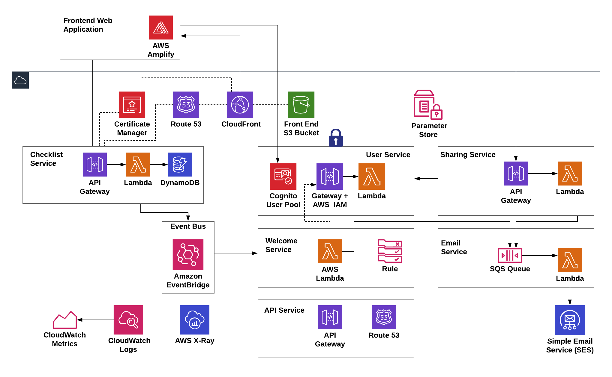
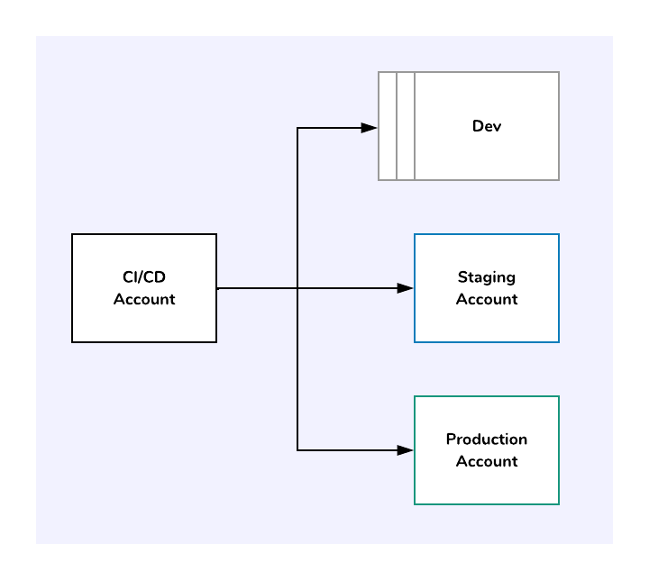

# SLIC Starter

**ℹ️ Note**
SLIC Starter is an archived project. It's a useful reference for ideas on building serverless applications with AWS but is not actively maintained.  If you have any questions or need any help building modern applications on AWS, reach out to us on [by email](hello@fourtheorem.com).

---

[](http://www.serverless.com)
[](https://standardjs.com)
[](http://commitizen.github.io/cz-cli/)
[](./LICENSE)

**Jump to:** [Getting Started](#5-getting-started) | [Quick Start](docs/QUICK_START.md) | [CI/CD](#37-cicd) | [Architecture](#2-application-architecture) | [Contributing](docs/CONTRIBUTING.md)

---

**SLIC Starter** is a complete starter project for production-grade **serverless** applications on AWS. SLIC Starter uses an opinionated, pragmatic approach to structuring, developing and deploying a modern, serverless application with one simple, overarching goal:

> _Get your serverless application into production fast_

<!-- TOC -->

- [SLIC Starter](#slic-starter)
  - [1. How does SLIC starter help you?](#1-how-does-slic-starter-help-you)
  - [2. Application Architecture](#2-application-architecture)
  - [3. What does it provide?](#3-what-does-it-provide)
    - [3.1. Structure](#31-structure)
    - [3.2. Tooling Choice](#32-tooling-choice)
    - [3.3. Authentication](#33-authentication)
    - [3.4. Data Access with a RESTful API](#34-data-access-with-a-restful-api)
    - [3.5. Messaging](#35-messaging)
    - [3.6. Front End](#36-front-end)
    - [3.7. CI/CD](#37-cicd)
    - [3.8. Testing](#38-testing)
    - [3.9. Observability](#39-observability)
    - [3.10. Secret Management](#310-secret-management)
  - [4. Before you Begin!](#4-before-you-begin)
  - [5. Getting Started](#5-getting-started)
  - [6. Getting to your First Successful Deployment](#6-getting-to-your-first-successful-deployment)
    - [6.1. Set up your domain for email](#61-set-up-your-domain-for-email)
  - [7. Local Execution](#7-local-execution)
  - [8. Frontend development with a real back end](#8-frontend-development-with-a-real-back-end)
  - [9. Demo](#9-demo)
  - [10. Code Style and Syntax](#10-code-style-and-syntax)
  - [11. Who is behind it?](#11-who-is-behind-it)
  - [12. Other Resources](#12-other-resources)
  - [13. Contributing](#13-contributing)
  - [14. License](#14-license)

<!-- /TOC -->

## 1. How does SLIC starter help you?

1. Serverless development involves a lot of decisions around which approach to take for a multitude of issues. It aims to remove 80% of this decision making and let you focus on building valuable features.
1. It is deployable _out of the box_. Without making any code changes, you have a cloud-hosted production-grade app as a starting point for your product.
1. It comes with solutions for the common hard-to-solve problems such as project structuring, deployment, local environments, testing, monitoring and more. Read on to find out more!
1. It delivers a fully automated CI/CD build and deployment process that gives reassurances around the state and quality of each environment.

This project is free to use by enterprise, startups, students, educators, enthusiasts and skeptics alike. We actively encourage contributions, suggestions and questions from _anyone_.

## 2. Application Architecture



For the CICD pipeline architecture, see [CI/CD](#37-cicd)

## 3. What does it provide?

SLIC Starter is a complete, working application. By including all the aspects of a real application, SLIC Starter goes beyond a typical demo project. You are encouraged to:

- Take SLIC Starter and copy it
- Use it to learn
- Build your own production application
- Contribute ideas and feedback!

### 3.1. Structure

We chose a _monorepo_ approach using [npm workspaces](https://docs.npmjs.com/cli/v8/using-npm/workspaces) . Every serverless module (service) is a package under the [packages](./packages) directory. The monorepo/multirepo decision is always a tricky one, but we think monorepo works best here for these reasons.

1. Getting started and onboarding developers becomes easier when everything is in one repo.
2. Dependencies on common code and libraries are easier when you avoid referencing.
  Each package's common dependencies are also installed once and the packages are symlinked for reuse and being DRY.
3. All application code and infrastructure-as-code exist together.
4. Changes across multiple services are managed and tracked in the same commits, PRs and merges.
5. End-to-end tests exist in the same place as the code under test.

### 3.2. Tooling Choice

SLIC Starter uses:

1. AWS, including Cognito, DynamoDB, Lambda, API Gateway, IAM, Secrets Manager, Systems Manager, S3, Route 53, X-Ray, CodeBuild, CodePipeline, Amplify, SQS, Cloudwatch.
1. [The Serverless Framework](https://serverless.com) and plugins for serverless modules
1. [CDK](https://github.com/awslabs/aws-cdk) for managing and deploying the CI/CD pipeline
1. [Node.js](http://nodejs.org/) for service implementation. This can be replaced with the language of your choice!

### 3.3. Authentication

Authentication is a difficult problem with constantly-evolving security requirements. SLIC Starter uses [Cognito](https://aws.amazon.com/cognito/) and the [Amplify](https://aws-amplify.github.io/) SDK to remove the burden. Cognito can still be complex when getting started. SLIC Starter provides a complete setup with user pool and identity pool, sign-up and login. Amplify is used to authenticate in the web client. There is even a Cognito/Amplify simulation that allows you to work in local development mode, avoiding the need for a real Cognito backend in all cases.

### 3.4. Data Access with a RESTful API

SLIC Starter includes useful, working examples of typical CRUD (create, read, update and delete) actions with a REST API. Currently, these APIs are implemented with DynamoDB and the `DocumentClient` API. For an example of this, look at the implementation of the [Checklist](./packages/checklist-service) service.
Upon first deploying SLIC Starter, the API Service will create Record Sets and an API Domain Name for your API. APIGateway and Route53 handles the creation of these resources for us.

### 3.5. Messaging

A major goal of SLIC Starter is to provide a realistic, working examples for event-driven messaging, including a scalable and real-time message bus.

Following the KISS principle, SLIC Starter only requires the simplest messaging possible _for now_, so we use EventBridge (originally inspired by [this article](https://aws.amazon.com/blogs/aws/building-serverless-pipelines-with-amazon-cloudwatch-events/)!)

### 3.6. Front End

SLIC Starter has a front-end web application. It uses React, Redux and [Material UI](http://material-ui.com/). Out of the box, the front end is configured, built, packaged and deployed to S3 and CloudFront with a domain and HTTPS certificate.

1. API calls and authentication are managed with AWS Amplify
1. The build process automatically looks up the Cognito parameters so you don't have to
1. The API domain name is set by convention (The API for `sliclists.com` is `api.sliclists.com`)

### 3.7. CI/CD

Getting continuous integration and deployment (CI/CD) right is one of the most important things in your microservice or serverless project. Having a good foundation here allows you to keep making changes fast. It's also fairly difficult to get right. SLIC Starter has made key choices to help you here.

1. SLIC Starter uses multiple AWS accounts for secure isolation of environments. If you are getting started, or just restricted to one account for any reason, you can always use the same account for everything. In the ideal case, you will have a separate account for development, staging, and production. 
1. CodePipeline and CodeBuild are used, so the CI/CD process is deployed using Infrastructure-as-Code, just like the application itself. For this, we use the [CDK](https://github.com/awslabs/aws-cdk).
1. The process dynamically creates a CodePipeline pipeline for each target environment, and CodeBuild projects for _each module_(service) in the application
1. Integration (API) and end-to-end UI tests are run before deployment to production. A manual approval step before deployment to production is included too.
1. The CICD stack also include the Pipeline Dashboard application from the [Serverless Application Repository](https://serverlessrepo.aws.amazon.com/applications/arn:aws:serverlessrepo:us-east-1:923120264911:applications~pipeline-dashboard), giving you an automatic CloudWatch dashboard of the performance of all pipelines. (Credit to @heitorlessa for the idea and helping to get this working).


### 3.8. Testing

SLIC Starter covers automated testing with:

1. Unit tests for each service. 100% code coverage is achieved with the exception of the front end!
1. Integration (API) tests that exercise the back end
1. UI end-to-end tests using [TestCafe](https://github.com/DevExpress/testcafe)

All tests can be run in local development mode as well as against a fully-deployed environment. The API and E2E tests are executed against a staging environment before deployment to production.

For details on integration (API) tests, see the [README.md in integration-tests](./packages/integration-tests/README.md)
For details on end-to-end (E2E) tests, see the [README.md in e2e-tests](./packages/e2e-tests/README.md)

### 3.9. Observability

SLIC Starter provides a basis for observability including:

- Alarms and Dashboards are provided using the [SLIC Watch serverless plugin](https://github.com/fourTheorem/slic-watch).
- [X-Ray](https://docs.aws.amazon.com/xray/latest/devguide/xray-concepts.html) is enabled for all services.
- CloudWatch Logs is used for all log output and can be queried with [CloudWatch Logs Insights](https://docs.aws.amazon.com/AmazonCloudWatch/latest/logs/AnalyzingLogData.html)

### 3.10. Secret Management

We use AWS Secrets Manager for storing the GitHub personal access token and AWS Systems Manager Parameter Store for storing other secrets, such as API access tokens.

## 4. Before you Begin!

SLIC Starter is designed to get you up in running with a real-world application as quickly as possible. The fact that we go beyond the average sample application, there is a bit more involved in getting to production. For example:

1. We assume that you want to keep the CICD, staging and production accounts separate in most cases. These can be set up under one root account using [AWS Organizations](https://aws.amazon.com/organizations/). SLIC Starter also now supports single account deployment, so CICD, staging and production environments can be configured to live under the one account.
2. SLIC Starter assumes you are using a registered domain (like `sliclists.com`) and will set up DNS entries for use in production (like `api.sliclists.com`) and staging (`stg.sliclists.com`, `api.stg.sliclists.com`). If you want to get up and running with a system quickly, you can skip domains by following the [QUICK_START.md](docs/QUICK_START.md) guide.
3. By using domains, you will have to take some steps to set up DNS records and allow these to propagate.
4. When your application is automatically deploying as part of the CICD process and HTTPS certificates are being created, you (the domain owner) will be sent an email by Amazon Route53 to verify that you are the domain owner.
5. You will also have to validate your domains with SES in order to have permissions for emails to be sent.

## 5. Getting Started

This section covers a full deployment using multiple accounts with domain names and HTTPS certificates. It takes quite a bit longer than your average sample app since there is DNS and certificate approval involved. If you want to try SLIC Starter out in a single account without domains, go to the [QUICK_START.md](docs/QUICK_START.md)

To set up deployment to your own accounts, first run through these steps.

1. Fork the repository into your own account or organization on GitHub. If you don't use GitHub, you will have to tweak the source project in the CICD module ([pipeline-stack.ts](./packages/cicd/stacks/pipeline-stack.ts))
2. Decide when DNS name you will use for your application. If you need to register one, the best place to do this is probably in your production account using [Amazon Route 53](https://aws.amazon.com/route53/). If you don't want to use a domain for the frontend application and API, you can follow the simpler [QUICK_START.md](docs/QUICK_START.md) guide.
3. Edit `app.yml`. This is an important step, so ensure you change all values to suit your needs.
 * Update to point to your correct repository (Change `owner` and `name` under `sourceRepo`)
 * Edit `domainConfig` to point to your domain. Use a domain you own so you can update DNS entries to point to your deployed environment. When the deployment process runs, the domain owner will be sent an email to verify ownership before the deployment completes.
 * Disable [SLIC Watch](https://github.com/fourtheorem/slic-watch]) by setting `enabled` to `false` and the topic ARN to `''`, unless you need alarms and dashboards out of the box. If you aren't sure what to do, or don't want to incur the cost of additional dashboards and alarms, disable it. If you want nice alarms and dashboards, set up an SNS Topic as your alarms destination. Ensure that this topic it is accessible from all accounts by updating the SNS Topic Access Policy.
4. Create a [Mailosaur](https://mailosaur.com) account. This is required for integration and end-to-end tests to verify that the application is sending emails as expected. Take the Mailosaur server ID and API key and add them in your CICD account to the Parameter Store as `SecretString` values with the following names
- `/test/mailosaur/serverId`
- `/test/mailosaur/apiKey`
  These are picked up by the integration and end-to-end test CodeBuild projects.
5. Create a secret string in System Manager Parameter store for each target account (e.g, stg or prod) with a value used to sign and verify verification codes - the parameter name should be `/STAGE/sharing-service/code-secret` where STAGE is the stage you are deploying to (dev, stg or prod). You can choose any secure password for this, since it's a shared secret. The important thing is that it is not stored in plaintext anywhere.
6. Set up the CICD pipeline according to [cicd/packages/README.md](./packages/cicd/README.md)
7. Trigger your pipeline by committing your changes to the repository

## 6. Getting to your First Successful Deployment

Once you get all services in staging successfully deployed, you might find that the test stage fails. This is likely to do with the front end being inaccessible. As we already mentioned, your DNS entries will need to be set up. Let's understand how this all works better!

1. CICD will create `NS` and `A` records for staging in your staging account. When production deployment happens, it will also create `NS` and `A` records in your production account.
1. You need to decide who will own the records for your APEX domain, i.e. the parent domain (such as `sliclists.com`)
1. If you let your production AWS account own these records, you need to copy the `NS` records from your production Route53 into your domain registration name server settings. You will then need to copy the `NS` record (only the `NS` record!) for staging into your production Route 53 for the apex domain and give the NS record the staging domain (e.g., `stg.sliclists.com`).
1. Alternatively, if you want another provider to own the nameserver records for your domain, you should copy all generated DNS records (except `NS` type records) from your staging and production account into that provider's DNS records.

Once you have set up the required DNS configuration and it has propagated, your front end staging application should be available at `https://stg.YOUR-DOMAIN.TLD` and you can click _Retry_ on the test phase of the pipeline!

### 6.1. Set up your domain for email
For the `email-service` to send emails, you must choose a 'From:' address and set it in parameter store. The parameter name is `/<STAGE>/email-service/from-address`. `<STAGE>` should be replaced with `stg` or `prod` as appropriate.

In order for the email service to send requests to SES, either the email address or the domain needs to be verified. This is not automatically done as part of the SLIC Starter deployment.

If you are using SLIC with a domain configuration, the verification process is quite straightforward because we use Route 53 for our DNS records. See [here](https://docs.aws.amazon.com/ses/latest/DeveloperGuide/receiving-email-getting-started-verify.html) for documentation on how to achieve domain verification through the AWS Management Console.

By default, SES will require validation of each email address to which emails are being sent. To avoid this, you can [request a sending limit increase](https://docs.aws.amazon.com/ses/latest/DeveloperGuide/request-production-access.html), which will remove your account/region from the SES Sandbox.

## 7. Local Execution

It is possible to run much of the application functionality locally and get a reasonable simulation of what the fully-deployed application does. Of course, every local simulation of an AWS service has limitations, so this mode should not be relied on for pre-production testing. It allows for fast feedback on simple API and frontend changes.

Local execution support utilises [Localstack](https://github.com/localstack/localstack), [serverless-offline](https://www.npmjs.com/package/serverless-offline) and [serverless-dynamodb-local](https://www.serverless.com/plugins/serverless-dynamodb-local)

Prerequisites:
- The Localstack configuration requires [docker-compose](https://docs.docker.com/compose/)
- `serverless-dynamodb-local` installs and runs [DynamoDB Local](https://docs.aws.amazon.com/amazondynamodb/latest/developerguide/DynamoDBLocal.html) so it requires a Java Runtime


1. Start Localstack:
```
docker-compose up -d
```
2. Set up the DynamoDB Local server and table in the checklist service:
```
npm exec --workspace packages/checklist-service --call "sls dynamodb install --region us-east-1"
```
3. Start the checklist service:
```
npm start --workspace=packages/checklist-service
```
4. Start the front end in local mode:
```
npm start --workspace=packages/frontend
```

You can run all other backend services using `npm start` in each package root.

## 8. Frontend development with a real back end

Normally, when you run `npm start` in the `frontend` package, it will use `localhost` for APIs and mock Amplify/Cognito configuration values.
To run the front end locally with a _real backend_ deployed to AWS, you need to generate a `.env` file that will be picked up by [Create React App](https://create-react-app.dev/docs/adding-custom-environment-variables/).

For example, to use the development environment deployed to AWS, you can generate an `env` file. Your AWS credentials need to be configured to talk to the development account in order for this to work.

```
SLIC_STAGE=dev node scripts/fetch-deployment-config.js
cp .env.production .env.local
```


Then you can restart the front end:
```
npm start --workspace=packages/frontend
```

`.env.local` will be picked up before the default `.env.development` file and will ensure your front end is configured against the development back end.

## 9. Demo

SLIC Starter provides a fully-featured application for managing checklists called _SLIC Lists_. SLIC Starter is self hosting, so SLIC Lists is continuously deployed to [sliclists.com](https://sliclists.com) from _this repository!_

## 10. Code Style and Syntax

SLIC Starter uses [Standard](https://standardjs.com/) with [ESLint](https://eslint.org/).

- ESLint is configured to format the code on commit (run manually with `npm run format`).
- Linting can be run with `npm run lint`.

## 11. Who is behind it?

SLIC Starter is open source and contributions are welcome from everyone. It was started by the team at [fourTheorem](https://fourtheorem.com), also the authors of the book, [AI as a Service](https://www.aiasaservicebook.com/), a [Manning publication](https://www.manning.com/books/ai-as-a-service) on Serverless, AI-enabled applications.

## 12. Other Resources

There are many other amazing resources to help you get started, learn and evolve your Serverless practice. Here are a few recommendations!

- [Serverless Stack Tutorial](https://serverless-stack.com/) - A really well-crafted, step-by-step tutorial covering many best practices
- [AWS Serverless Airline Booking](https://github.com/aws-samples/aws-serverless-airline-booking) - A complete web application built on Serverless AWS with Amplify and GraphQL. The Twitch videos covering the architecture and build of this project are available [here on YouTube](https://www.youtube.com/watch?v=qBN98Co_0aw&list=PLhr1KZpdzukcYWC1xD-vidMZf2uilGkor&index=7)

## 13. Contributing

See [CONTRIBUTING.md](docs/CONTRIBUTING.md)

## 14. License

Copyright fourTheorem Ltd. 2018-2022. Distributed under the MIT License. See [LICENSE](LICENSE)
