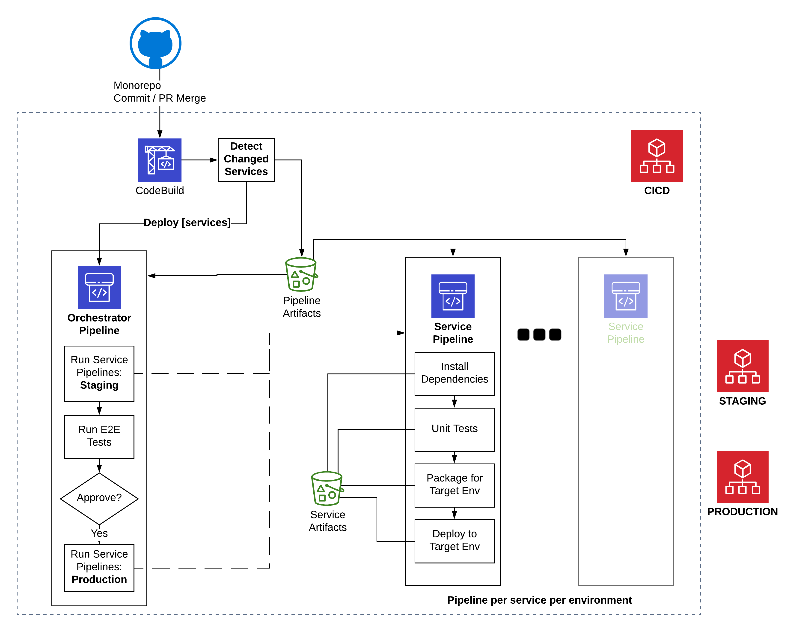

# SLIC Starter

[](http://www.serverless.com)
[](https://github.com/prettier/prettier)
[](./LICENSE)

**Jump to:** [Getting Started](#getting-started) | [Quick Start](./QUICK_START.md) | [CI/CD](#cicd) | [Architecture](#application-architecture) | [Contributing](./CONTRIBUTING.md)

---

**SLIC Starter** is a complete starter project for production-grade **serverless** applications on AWS. SLIC Starter uses an opinionated, pragmatic approach to structuring, developing and deploying a modern, serverless application with one simple, overarching goal:

> _Get your serverless application into production fast_

<!-- TOC -->

- [How does SLIC starter help you?](#how-does-slic-starter-help-you)
- [Application Architecture](#application-architecture)
- [What does it provide?](#what-does-it-provide)
  - [Structure](#structure)
  - [Tooling Choice](#tooling-choice)
  - [Authentication](#authentication)
  - [Data Access with a RESTful API](#data-access-with-a-restful-api)
  - [Messaging](#messaging)
  - [Front End](#front-end)
  - [CI/CD](#cicd)
  - [Testing](#testing)
  - [Monitoring](#monitoring)
  - [Logging](#logging)
  - [Secret Management](#secret-management)
  - [User Accounts and Authorization](#user-accounts-and-authorization)
- [Before you Begin!](#before-you-begin)
- [Getting Started](#getting-started)
- [Getting to your First Successful Deployment](#getting-to-your-first-successful-deployment)
  - [Set up your domain for email](#set-up-your-domain-for-email)
- [Local Development](#local-development)
- [Backend configuration for front end](#backend-configuration-for-front-end)
- [Demo](#demo)
- [Code Style and Syntax](#code-style-and-syntax)
- [Who is behind it?](#who-is-behind-it)
- [Other Resources](#other-resources)
- [Troubleshooting](#troubleshooting)
- [Contributing](#contributing)
- [License](#license)

<!-- /TOC -->

## How does SLIC starter help you?

1. Serverless development involves a lot of decisions around which approach to take for a multitude of issues. It aims to remove 80% of this decision making and let you focus on building valuable features.
1. It is deployable _out of the box_. Without making any code changes, you have a cloud-hosted production-grade app as a starting point for your product.
1. It comes with solutions for the common hard-to-solve problems such as project structuring, deployment, local environments, testing, monitoring and more. Read on to find out more!
1. It delivers a fully automated CI/CD build and deployment process that gives reassurances around the state and quality of each environment.

This project is free to use by enterprise, startups, students, educators, enthusiasts and skeptics alike. We actively encourage contributions, suggestions and questions from _anyone_.

## Application Architecture


For the CICD pipeline architecture, see [CI/CD](#cicd)

## What does it provide?

SLIC Starter is a complete, working application. By including all the aspects of a real application, SLIC Starter goes beyond a typical demo project. You are encouraged to:

- Take SLIC Starter and copy it
- Use it to learn
- Build your own production application
- Contribute ideas and feedback!

### Structure

We chose a _monorepo_ approach. Every serverless module (service) is a folder at the parent level of the repo. The monorepo/multirepo decision is always a tricky one but we think monorepo works best here for these reasons.

1. Getting started and onboarding developers becomes easier when everything is in one repo.
1. Dependencies on common code and libraries are easier when you avoid referencing.
1. All applcation code and infrastructure-as-code exist together.
1. Changes across multiple services are managed and tracked in the same commits, PRs and merges.
1. End-to-end tests exist in the same place as the code under test.

### Tooling Choice

SLIC Starter uses:

1. AWS, including Cognito, DynamoDB, Lambda, API Gateway, IAM, Secrets Manager, Systems Manager, S3, Route 53, X-Ray, CodeBuild, CodePipeline, Amplify, SQS, Cloudwatch.
1. [The Serverless Framework](https://serverless.com) and plugins for serverless modules
1. [CDK](https://github.com/awslabs/aws-cdk) for managing and deploying the CI/CD pipeline
1. [Node.js](http://nodejs.org/) for service implementation. This can be replaced with the language of your choice!

### Authentication

Authentication is a difficult problem with constantly-evolving security requirements. SLIC Starter uses [Cognito](https://aws.amazon.com/cognito/) and the [Amplify](https://aws-amplify.github.io/) SDK to remove the burden. Cognito can still be complex when getting started. SLIC Starter provides a complete setup with user pool and identity pool, sign-up and login. Amplify is used to authenticate in the web client. There is even a Cognito/Amplify simulation that allows you to work in local development mode, avoiding the need for a real Cognito backend in all cases.

### Data Access with a RESTful API

SLIC Starter includes useful, working examples of typical CRUD (create, read, update and delete) actions with a REST API. Currently, these APIs are implemented with DynamoDB and the `DocumentClient` API. For an example of this, look at the implementation of the [Checklist](./checklist-service) service.
Upon first deploying SLIC Starter, the API Service will create Record Sets and an API Domain Name for your API. APIGateway and Route53 handles the creation of these resources for us.

### Messaging

A major goal of SLIC Starter is to provide a realistic, working examples for event-driven messaging, including a scalable and real-time message bus.

Following the KISS principle, SLIC Starter only requires the simplest messaging possible _for now_, so we use CloudWatch Events as inspired by [this article](https://aws.amazon.com/blogs/aws/building-serverless-pipelines-with-amazon-cloudwatch-events/).

### Front End

SLIC Starter has a front-end web application. It uses React, Redux and [Material UI](http://material-ui.com/). Out of the box, the front end is configured, built, packaged and deployed to S3 and CloudFront with a domain and HTTPS certificate.

1. API calls and authentication are managed with AWS Amplify
1. The build process automatically looks up the Cognito parameters so you don't have to
1. The API domain name is set by convention (The API for `sliclists.com` is `api.sliclists.com`)

### CI/CD

Getting continuous integration and deployment (CI/CD) right is one of the most important things in your microservice or serverless project. Having a good foundation here allows you to keep making changes fast. It's also fairly difficult to get right. SLIC Starter has made key choices to help you here.

1. SLIC Starter uses multiple AWS accounts for secure isolation of environments. We assume a production, test(staging) and cicd account exist. We have made sure that you can use the same account ID for each of these in case you are restricted to one account and a multi-account setup is not feasible.
1. CodePipeline and CodeBuild are used, so the CI/CD process is deployed using Infrastructure-as-Code, just like the serverless application itself. For this, we use the [CDK](https://github.com/awslabs/aws-cdk).
1. The process dynamically creates a pipeline for _each module_(service) in the application. An **orchestrator pipeline** detects which modules need to be built, monitors their pipelines and triggers deployment to the staging account.
1. Integration (API) and end-to-end UI tests are run before deployment to production. A manual approval step before deployment to production is included too.
1. The entire pipeline is started by a CodeBuild job. CodeBuild is used because it can monitor changes on any branch. This will enable feature branch deployments in the future. This _source_ CodeBuild job also runs a change detection script to determine which services need to be built and deployed. Unchanged services are skipped throughtout the deployment process.
1. The CICD stack also include the Pipeline Dashboard application from the [Serverless Application Repository](https://serverlessrepo.aws.amazon.com/applications/arn:aws:serverlessrepo:us-east-1:923120264911:applications~pipeline-dashboard), giving you an automatic CloudWatch dashboard of the performance of all pipelines. (Credit to @heitorlessa for the idea and helping to get this working).



### Testing

SLIC Starter covers automated testing with:

1. Unit tests for each service. 100% code coverage is achieved with the exception of the front end!
1. Integration (API) tests that exercise the back end
1. UI end-to-end tests using [TestCafe](https://github.com/DevExpress/testcafe)

All tests can be run in local development mode as well as against a fully-deployed environment. The API and E2E tests are executed against a staging environment before deployment to production.

For details on integration (API) tests, see the [README.md in integration-tests](./integration-tests/README.md)

### Monitoring

X-Ray is enabled for all services and centralized logging is supported. This is pretty basic in terms of monitoring support so much more is planned and [contributions](./CONTRIBUTING.md) are welcomed.

### Logging

As a default log centralization solution, SLIC Starter publishes logs to [logz.io](https://logz.io). The [logging](./logging) module handles this using the logz.io forwarder. This is integrated into each service's Lambda function using the [serverless-log-forwarding](https://github.com/amplify-education/serverless-log-forwarding) plugin.

For further details, see the [logging README](./logging/README.md)

### Secret Management

We use AWS Secrets Manager for storing the GitHub personal access token and AWS Systems Manager Parameter Store for storing other secrets, such as API access tokens.

### User Accounts and Authorization

_Coming soon_. SLIC Starter will include support for roles and Role-Based Access Control (RBAC).

## Before you Begin!

SLIC Starter is designed to get you up in running with a real-world application as quickly as possible. The fact that we go beyond the average sample application, there is a bit more involved in getting to production. For example:

1. We assume that you want to keep the CICD, staging and production accounts separate in most cases. These can be set up under one root account using [AWS Organizations](https://aws.amazon.com/organizations/). SLIC Starter also now supports single account deployment, so CICD, staging and production environments can be configured to live under the one account.
2. SLIC Starter assumes you are using a registered domain (like `sliclists.com`) and will set up DNS entries for use in production (like `api.sliclists.com`) and staging (`stg.sliclists.com`, `api.stg.sliclists.com`). If you want to get up and running with a system quickly, you can skip domains by following the [QUICK_START.md](./QUICK_START.md) guide.
3. By using domains, you will have to take some steps to set up DNS records and allow these to propagate.
4. When your application is automatically deploying as part of the CICD process and HTTPS certificates are being created, you (the domain owner) will be sent an email by Amazon Route53 to verify that you are the domain owner.
5. You will also have to validate your domains with SES in order to have permissions for emails to be sent.

## Getting Started

This section covers a full deployment using multiple accounts with domain names and HTTPS certificates. It takes quite a bit longer than your average sample app since there is DNS and certificate approval involved. If you want to try SLIC Starter out in a single account without domains, go to the [QUICK_START.md](./QUICK_START.md)]

To set up deployment to your own accounts, first run through these steps.

1. Decide when DNS name you will use for your application. If you need to register one, the best place to do this is probably in your production account using [Amazon Route 53](https://aws.amazon.com/route53/).
2. Copy `slic-config.json.sample` to `slic-config.json` and edit it to include the AWS Account IDs of your staging, production and CI/CD accounts. For single account deployment the Account ID's of CICD, Production and Staging would all be the same. This file is `.gitignore`'d so your account IDs are not commited to Git. Also specify your GitHub repository details and DNS domain for your deployment. Use a domain you own so you can update DNS entries to point to your deployed environment. When the deployment process runs, the domain owner will be sent an email to verify ownership before the deployment completes.
3. Fork the repository into your own account or organization on GitHub. If you don't use GitHub, you will have to tweak the source project in the CICD module ([source-project.ts](./cicd/lib/project/source-project.ts))
4. Enable CodeBuild to access your GitHub repo. The most reliable way to do this is to use a Personal Access Token with access to create webhooks on your repository. The guide from AWS on how to do this is [here](https://docs.aws.amazon.com/codebuild/latest/userguide/sample-access-tokens.html).
5. (Optional - this will be required for repo tagging). Set up GitHub authentication for your repo. Create a GitHub Personal Access Token and add it as an secret with the name `GitHubPersonalAccessToken` in Secrets Manager _in the CICD account_. See [this post](https://medium.com/@eoins/securing-github-tokens-in-a-serverless-codepipeline-dc3a24ddc356) for more detail on this approach.
6. Under the parent directory, open the file `common-config.json`. If desired, you can configure the default regions and domain prefixes by account. If you have no reason to change them, leave the default values as they are.
7. Create a [Mailosaur](https://mailosaur.com) account. Take the server ID and API key and add them in your CICD account to the Parameter Store as `SecretString` values with the following names

- `test/mailosaur/serverId`
- `test/mailosaur/apiKey`
  These are picked up by the integration and end-to-end test CodeBuild projects.

9. Create a secret string in System Manager Parameter store with a value used to sign and verify verification codes - the parameter name should be `/STAGE/sharing-service/code-secret` where STAGE is the stage you are deploying to (dev, stg or prod).
10. Give permissions for your CICD account to deploy to staging and production accounts.

```
npm install -g serverless
cd cicd/cross-account
AWS_PROFILE=your-staging-account serverless deploy
AWS_PROFILE=your-production-account serverless deploy
```

11. Deploy the CI/CD pipeline to your CICD account.

```
cd cicd
npm install
npm run build
AWS_PROFILE=your-cicd-account npm run cdk -- bootstrap
SLIC_NS_DOMAIN=your_domain AWS_PROFILE=your-cicd-account npm run deploy
```

12. Trigger your pipeline by commiting your changes to the repository
13. Monitor your deployment by viewing the orchestrator pipeline in the AWS Console CodePipeline page.
14. Wait for your deployment to fail! _Wait, what?_ Yes, your first deployment will fail. This is expected and all part of the process. Read on to find out more!

## Getting to your First Successful Deployment

The CICD process attempts to build and deploy each service in parallel. This is done so you get quick feedback and to improve the overall deployment speed. It also means that deployment can fail if there are dependencies between services. Out of the box, SLIC Starter has a `certs` module that sets up a Route 53 Hosted Zone and some certificates. These are required by the `frontend` and `checklist-service` services, so those builds will fail if the cerificates aren't ready yet. This is just one example. There are other services that depend on common resources so it will require a few retries in both staging and production before everything is deployed.

_Note_ that deployment of some services can take quite some time! In particular, `frontend` deployment will wait until the CloudFront distribution has been created. This can take _at least_ 15 minutes.

You can inspect the failures in the Orchestrator Pipeline view in the CodePipeline console of your CICD account. You can retry the `stgDeploy` phase by clicking the _Retry_ button in the pipeline.

Once you get all services in staging successfully deployed, you might find that the test stage fails. This is likely to do with the front end being inaccessible. As we already mentioned, your DNS entries will need to be set up. Let's understand how this all works better!

1. CICD will create `NS` and `A` records for staging in your staging account. When production deployment happens, it will also create `NS` and `A` records in your production account.
1. You need to decide who will own the records for your APEX domain, i.e. the parent domain (such as `sliclists.com`)
1. If you let your production AWS account own these records, you need to copy the `NS` records from your production Route53 into your domain registration name server settings. You will then need to copy the `NS` record (only the `NS` record!) for staging into your production Route 53 for the apex domain and give the NS record the staging domain (e.g., `stg.sliclists.com`).
1. Alternatively, if you want another provider to own the nameserver records for your domain, you should copy all generated DNS records (except `NS` type records) from your staging and production account into that provider's DNS records.

Once you have set up the required DNS configuration and it has propagated, your front end staging application should be available at `https://stg.YOUR-DOMAIN.TLD` and you can click _Retry_ on the test phase of the pipeline!

### Set up your domain for email

For the `email-service` to send emails, you must choose a 'From:' address and set it in parameter store. The paramter name is `/<STAGE>/email-service/from-address`. `<STAGE>` should be replaced with `stg` or `prod` as appropriate.

order for the email service to send requests to SES, either the email address or the domain needs to be verified. This is not automatically done as part of the SLIC Starter deployment.

If you are using SLIC with a domain configuration, the verification process is quite straightforward because we use Route 53 for our DNS records. See [here](https://docs.aws.amazon.com/ses/latest/DeveloperGuide/receiving-email-getting-started-verify.html) for documentation on how to achieve domain verification throught the AWS Management Console.

By default, SES will require validation of each email address to which emails are being sent. To avoid this, you can [request a sending limit increase](https://docs.aws.amazon.com/ses/latest/DeveloperGuide/request-production-access.html), which will remove your account/region from the SES Sandbox.

## Local Development

Work on a more seamless local development environment is _in progress_. In the meantime, here's an introduction to running the `checklist-service` locally:

In backend services:

```
sls dynamodb install
```

Ensure that your AWS credentials are set to _some reasonable values_. For local development, any dummy value for `AWS_ACCESS_KEY_ID` and `AWS_SECRET_ACCESS_KEY` is sufficient. You can also opt to use an AWS profile if that's your preferred method for specifying AWS credentials.

```
SLIC_STAGE=local sls offline start --migrate true
```

## Backend configuration for front end

When working in local development, the backend configuration is pulled from [.env.local](./frontend/.env.local). When building the production frontend for any deployed _stage_, `npm run build` will, by default, generate a `.env.production` file. This file is `.gitignore`d so it will not be committed. The values for this file are dynamically generated using the CloudFormation outputs retrieved from the stage specified using the `SLIC_STAGE` environment variable.

## Demo

SLIC Starter provides a fully-featured application for managing checklists called _SLIC Lists_. SLIC Starter is self hosting, so SLIC Lists is continuously deployed to [sliclists.com](https://sliclists.com) from _this repository!_

## Code Style and Syntax

SLIC Starter uses [Prettier](https://github.com/prettier/prettier) for code formatting and [ESLint](https://eslint.org/) for syntax checking.

- Prettier is configured to format the code on commit (run manually with `npm run format` in each project)
- Linting can be run with `npm run lint` in each project

## Who is behind it?

SLIC Starter is open source and contributions are welcome from everyone. It was started by the team at [fourTheorem](https://fourtheorem.com), also the authors of the book, [AI as a Service](https://www.aiasaservicebook.com/), a [Manning publication](https://www.manning.com/books/ai-as-a-service) on Serverless, AI-enabled applications.

## Other Resources

There are many other amazing resources to help you get started, learn and evolve your Serverless practice. Here are a few recommendations!

- [Serverless Stack Tutorial](https://serverless-stack.com/) - A really well-crafted, step-by-step tutorial covering many best practices
- [AWS Serverless Airline Booking](https://github.com/aws-samples/aws-serverless-airline-booking) - A complete web application built on Serverless AWS with Amplify and GraphQL. The Twitch videos covering the architecture and build of this project are available [here on YouTube](https://www.youtube.com/watch?v=qBN98Co_0aw&list=PLhr1KZpdzukcYWC1xD-vidMZf2uilGkor&index=7)

## Troubleshooting

1. I get this error in the CodeBuild source project:

```
87/101 | 1:05:21 PM | CREATE_FAILED | AWS::CodeBuild::Project |
sourceProject (sourceProjectBCA86C81) Failed to call CreateWebhook, reason: Repository not found or permission denied.
```

- This is because your CodeBuild configuration does not have access to your GitHub account. To grant access, create a CodeBuild project manually in the AWS Console and grant access to your repository. This project can be safely deleted afterwards once CodeBuild has been granted access.

## Contributing

See [CONTRIBUTING.md](CONTRIBUTING.md)

## License

Copyright fourTheorem Ltd. 2018-2019. Distributed under the MIT License. See [LICENCE](LICENCE)
