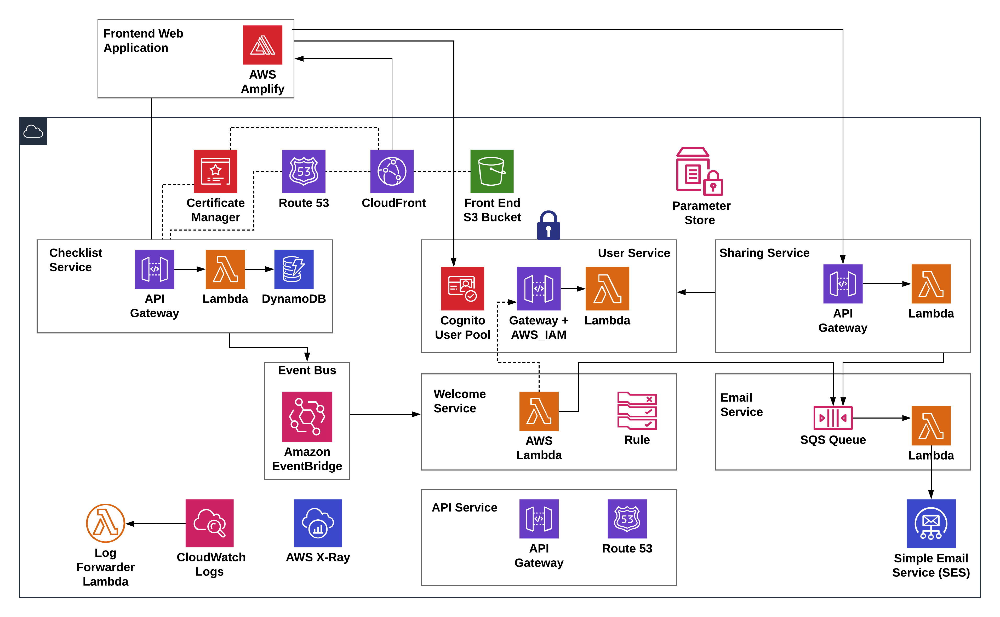

# SLIC Starter

[](https://github.com/prettier/prettier)

**SLIC Starter** is a complete starter project for production-grade **serverless** applications on AWS. SLIC Starter uses an opinionated, pragmatic appraoch to structuring, developing and deploying a modern, serverless application with one simple, overarching goal:

> _Get your serverless application into production fast_

_How does SLIC starter help you?_

1. Serverless development involves a lot of decisions around which approach to take for a multitude of issues. It aims to remove 80% of this decision making and let you focus on building valuable features.
1. It is deployable _out of the box_. Without making any code changes, you have a cloud-hosted production-grade app as a starting point for your product.
1. It comes with solutions for the common hard-to-solve problems such as project structuring, deployment, local environments, testing, monitoring and more. Read on to find out more!
1. It delivers a fully automated CI/CD build and deployment process that gives reassurances around the state and quality of each environment.

This project is free to use by enterprise, startups, students, educators, enthusiasts and skeptics alike. We actively encourage contributions, suggestions and questions from _anyone_.

## What does it provide?



SLIC Starter is a complete, working application. By including all the aspects of a real application, SLIC Starter goes beyond a typical demo project. You are encouraged to:

- Take SLIC Starter and copy it
- Use it to learn
- Build your own production application
- Contribute ideas and feedback!

### Structure

We chose a _monorepo_ approach. Every serverless module (service) is a folder at the parent level of the repo. The monorepo/multirepo decision is always a tricky one but we think monorepo works best here for these reasons.

1. Getting started and onboarding developers becomes easier when everything is in one repo.
1. Dependencies on common code and libraries are easier when you avoid referencing.
1. All applcation code and infrastructure-as-code exist together.
1. Changes across multiple services are managed and tracked in the same commits, PRs and merges.
1. End-to-end tests exist in the same place as the code under test.

### Tooling Choice

SLIC Starter uses:

1. AWS, including Cognito, DynamoDB, Lambda, API Gateway, IAM, Secrets Manager, Systems Manager, S3, Route 53, X-Ray, CodeBuild, CodePipeline, Amplify, SQS, Cloudwatch.
1. [The Serverless Framework](https://serverless.com) and plugins for serverless modules
1. [CDK](https://github.com/awslabs/aws-cdk) for managing and deploying the CI/CD pipeline
1. [Node.js](http://nodejs.org/) for service implementation. This can be replaced with the language of your choice!

### Authentication

Authentication is a difficult problem with constantly-evolving security requirements. SLIC Starter uses [Cognito](https://aws.amazon.com/cognito/) and the [Amplify](https://aws-amplify.github.io/) SDK to remove the burden. Cognito can still be complex when getting started. SLIC Starter provides a complete setup with user pool and identity pool, sign-up and login. Amplify is used to authenticate in the web client. There is even a Cognito/Amplify simulation that allows you to work in local development mode, avoiding the need for a real Cognito backend in all cases.

### Data Access with a RESTful API

SLIC Starter includes useful, working examples of typical CRUD (create, read, update and delete) actions with a REST API. Currently, these APIs are implemented with DynamoDB and the `DocumentClient` API. For an example of this, look at the implementation of the [Checklist](./backend) service.

### Messaging

A major goal of SLIC Starter is to provide a realistic, working examples for event-driven messaging, including a scalable and real-time message bus.

Following the KISS principle, SLIC Starter only requires the simplest messaging possible _for now_, so we use CloudWatch Events as inspired by [this article](https://aws.amazon.com/blogs/aws/building-serverless-pipelines-with-amazon-cloudwatch-events/).

### Front End

SLIC Starter has a front-end web application. It uses React, Redux and [Material UI](http://material-ui.com/). Out of the box, the front end is configured, built, packaged and deployed to S3 and CloudFront with a domain and HTTPS certificate.

1. API calls and authentication are managed with AWS Amplify
1. The build process automatically looks up the Cognito parameters so you don't have to
1. The API domain name is set by convention (The API for `sliclists.com` is `api.sliclists.com`)

### CI/CD

Getting continuous integration and deployment (CI/CD) right is one of the most important things in your microservice or serverless project. Having a good foundation here allows you to keep making changes fast. It's also fairly difficult to get right. SLIC Starter has made key choices to help you here.

1. SLIC Starter uses multiple AWS accounts for secure isolation of environemnts. By default, we assume a production, test(staging) and cicd account exist. These can be set up under one root account using [AWS Organizations](https://aws.amazon.com/organizations/).
1. CodePipeline and CodeBuild are used, so the CI/CD process is deployed using Infrastructure-as-Code, just like the serverless application itself. For this, we use the [CDK](https://github.com/awslabs/aws-cdk).
1. The process dynamically creates a pipeline for _each module_(service) in the application. An **orchestrator pipeline** detects which modules need to be built, monitors their pipelines and triggers deployment to the staging account.
1. Integration (API) and end-to-end UI tests are run before deployment to production. A manual approval step before deployment to production is included too.
1. The entire pipeline is started by a CodeBuild job. CodeBuild is used because it can monitor changes on any branch. This will enable feature branch deployments in the future. This _source_ CodeBuild job also runs a change detection script to determine which services need to be built and deployed. Unchanged services are skipped throughtout the deployment process.


### Testing

SLIC Starter covers automated testing with:

1. Unit tests for each service. 100% code coverage is achieved with the exception of the front end!
1. Integration (API) tests that exercise the back end
1. UI end-to-end tests using [TestCafe](https://github.com/DevExpress/testcafe)

All tests can be run in local development mode as well as against a fully-deployed environment. The API and E2E tests are executed against a staging environment before deployment to production.

### Monitoring

### Logging

As a default log centralization solution, SLIC Starter publishes logs to [logz.io](https://logz.io). The [logging](./logging) module handles this using the logz.io forwarder. This is integrated into each service's Lambda function using  the [serverless-log-forwarding](https://github.com/amplify-education/serverless-log-forwarding) plugin.

For further details, see the [logging README](./logging/README.md)

### Secret Management

We use AWS Secrets Manager for storing the GitHub personal access token and AWS Systems Manager Parameter Store for storing other secrets, such as API access tokens.

### User Accounts and Authorization

_Coming soon_. SLIC Starter will include support for roles and Role-Based Access Control (RBAC).

## Getting Started

To set up deployment to your own accounts, first run through these steps.

1. Enable CodeBuild to access your GitHub repo. The only way to do this is to create a temporary CodeBuild project in your CICD account and set up your GitHub repostitory as a source. Grant access to your GitHub repo. Your account now has access to the repo and the SLIC Starter CodeBuild will be able to monitor and clone your repo. The temporary CodeBuild project can alreay be deleted.
2. (Optional - this will be required for repo tagging). Set up GitHub authentication for your repo. Create a GitHub Personal Access Token and add it as an secret with the name `GitHubPersonalAccessToken` in Secrets Manager _in the CICD account_. See [this post](https://medium.com/@eoins/securing-github-tokens-in-a-serverless-codepipeline-dc3a24ddc356) for more detail on this approach.
3. Edit the account IDs in `cicd/cross-account/serverless.yml` and `cicd/config.ts`.
4. Create a [Mailosaur](https://mailosaur.com) account. Take the server ID and API key and add them in your CICD account to the Parameter Store as `SecretString` values with the following names

 * `test/mailosaur/serverId`
 * `test/mailosaur/apiKey`

These are picked up by the integration and end-to-end test CodeBuild projects.

5. Give permissions for your CICD account to deploy to staging and production accounts.

```
npm install -g serverless
cd cicd/cross-account
AWS_PROFILE=your-staging-account serverless deploy
AWS_PROFILE=your-production-account serverless deploy
```

6. Alter the `nsDomain` property in `backend/custom.yml` and `frontend/custom.yml`. Use a domain you own so you can update DNS entries to point to your deployed environment. When the deployment process runs, the domain owner will be sent an email to verify ownership before the deployment completes.
7. Deploy the CI/CD pipeline to your CICD account.

```
cd cicd
npm install
AWS_PROFILE=your-cicd-account npm deploy
```

8. Trigger your pipeline by commiting your changes to the repository
9. Monitor your deployment by viewing the orchestrator pipeline in the AWS Console CodePipeline page.

### Set up your domain for email

By default, SLIC Lists will send emails from `no-reply@[stage].sliclists.com`. In order for the email service to send requests to SES with this as the Source address, either the email address or the domain needs to be verified. This is not automatically done as part of the SLIC Starter deployment.
Because we use Route 53 for our DNS records, the verification process is quite straightforward. See [here](https://docs.aws.amazon.com/ses/latest/DeveloperGuide/receiving-email-getting-started-verify.html) for documentation on how to achieve domain verification throught the AWS Management Console.

## Local Development

In backend services:

```
sls dynamodb install
```

Ensure that your AWS credentials are set to _some reasonable values_. For local development, any dummy value for `AWS_ACCESS_KEY_ID` and `AWS_SECRET_ACCESS_KEY` is sufficient. You can also opt to use an AWS profile if that's your preferred method for specifying AWS credentials.

```
SLIC_STAGE=local sls offline start --migrate true
```

## Backend configuration for front end

When working in local development, the backend configuration is pulled from `.env.local`. When building the production frontend for any deployed _stage_, `npm run build` will, by default, generate a `.env.production` file. This file is `.gitignore`d so it will not be committed. The values for this file are dynamically generated using the CloudFormation outputs retrieved from the stage specified using the `SLIC_STAGE` environment variable.

## Demo

SLIC Starter provides a fully-featured application for managing checklists called _SLIC Lists_. SLIC Starter is self hosting, so SLIC Lists is continuously deployed to [sliclists.com](https://sliclists.com) from _this repository!_

## Code Style and Syntax

SLIC Starter uses [Prettier](https://github.com/prettier/prettier) for code formatting and [ESLint](https://eslint.org/) for syntax checking.

- Prettier is configured to format the code on commit (run manually with `npm run format` in each project)
- Linting can be run with `npm run lint` in each project

## Who is behind it?

SLIC Starter is open source and contributions are welcome from everyone. It was started by the team at [fourTheorem](https://fourtheorem.com), also the authors of the [AI as a Service](https://www.aiasaservicebook.com/), a [Manning publication](https://www.manning.com/books/ai-as-a-service) book on Serverless, AI-enabled applications.

## Contributing

See [CONTRIBUTING.md](CONTRIBUTING.md)

## License

Copyright fourTheorem Ltd. 2018-2019. Distributed under the MIT License. See [LICENCE](LICENCE)
